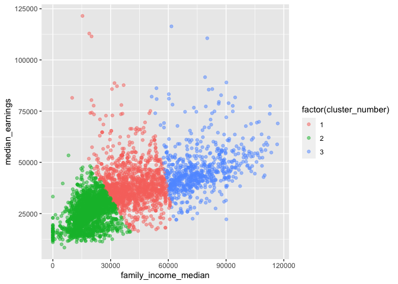
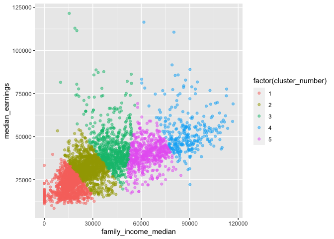
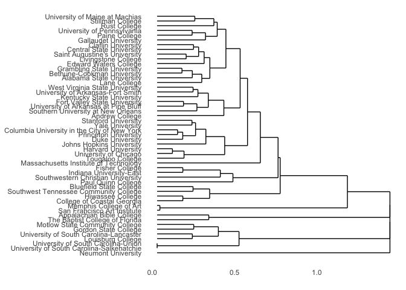
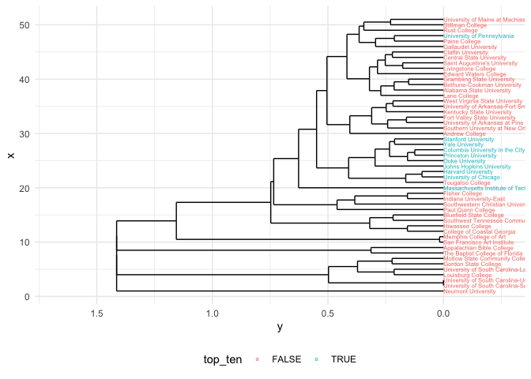

College\_admissions\_Rmarkdown
================

``` r
#Load libraries

library(dplyr)
```

    ## 
    ## Attaching package: 'dplyr'

    ## The following objects are masked from 'package:stats':
    ## 
    ##     filter, lag

    ## The following objects are masked from 'package:base':
    ## 
    ##     intersect, setdiff, setequal, union

``` r
library(ggplot2)
library(ggdendro)
library(stringr)
```

``` r
#Set seed for consistent output
set.seed(1234)

#Load datasets
setwd("~/Documents/RStudio_Uploads/College_admissions_data_set_analysis")
colleges_df = read.delim("colleges.tsv", sep = '\t',  header = TRUE)
colleges_data_dictionary_df = read.delim("colleges_data_dictionary.tsv", sep = '\t',  header = TRUE)
```

    ## $names
    ## [1] "cluster"      "centers"      "totss"        "withinss"     "tot.withinss"
    ## [6] "betweenss"    "size"         "iter"         "ifault"      
    ## 
    ## $class
    ## [1] "kmeans"

    ##   first_gen_share poverty_rate family_income_median median_earnings
    ## 1       0.4277000     8.533764             41022.79        39576.71
    ## 2       0.5502857    13.034961             18981.08        25700.62
    ## 3       0.2799861     6.289417             75910.38        46644.52
    ##   pell_grant_rate     top_ten
    ## 1       0.4561429 0.003571429
    ## 2       0.5782855 0.000000000
    ## 3       0.2817226 0.006934813

    ## [1] TRUE

<!-- -->

    ## $names
    ## [1] "cluster"      "centers"      "totss"        "withinss"     "tot.withinss"
    ## [6] "betweenss"    "size"         "iter"         "ifault"      
    ## 
    ## $class
    ## [1] "kmeans"

    ##   first_gen_share poverty_rate family_income_median median_earnings
    ## 1       0.5745424    14.871946             15434.12        22398.98
    ## 2       0.4986579     9.824019             27018.78        32069.37
    ## 3       0.4205195     8.568169             42037.35        43470.52
    ## 4       0.2120819     5.779659             88164.96        53003.41
    ## 5       0.3389793     6.803174             63785.36        40027.43
    ##   pell_grant_rate     top_ten
    ## 1       0.6173412 0.000000000
    ## 2       0.5162832 0.000000000
    ## 3       0.4366209 0.007792208
    ## 4       0.2090908 0.010238908
    ## 5       0.3547325 0.001594896

    ## [1] TRUE

<!-- -->

    ##             1          2          3          4          5          6          7
    ## 2  0.36211774                                                                  
    ## 3  0.24066747 0.30105955                                                       
    ## 4  0.28909690 0.36143171 0.24848491                                            
    ## 5  0.98514084 1.02201759 0.99327698 1.01012742                                 
    ## 6  0.29570129 0.32994895 0.25670501 0.31984335 0.93329654                      
    ## 7  0.76278295 0.80739087 0.76276826 0.76882533 1.16447401 0.75921496           
    ## 8  0.18752973 0.35992199 0.24859033 0.25909288 1.02658956 0.29232952 0.77578088
    ## 9  0.31721466 0.31468823 0.29780186 0.38605880 1.06700525 0.38596263 0.82736768
    ## 10 0.36279512 0.46969605 0.39253253 0.33232755 1.00680256 0.40202145 0.80898197
    ## 11 0.56073868 0.61190412 0.51515836 0.39740238 1.13918342 0.60251558 0.91186146
    ## 12 0.17504874 0.28736496 0.16026250 0.28947162 1.01932336 0.26689191 0.77038388
    ## 13 0.69015501 0.71563106 0.61536741 0.52663188 1.19271544 0.70977005 0.98501269
    ## 14 0.31312692 0.31533343 0.32218814 0.35019196 1.05165485 0.29375844 0.79003147
    ## 15 0.30785981 0.36484057 0.28147094 0.19868634 1.05632654 0.36399773 0.79770247
    ## 16 0.29801097 0.40297792 0.28099290 0.21882536 1.03787146 0.35346198 0.79520300
    ## 17 0.21371228 0.34360940 0.20769201 0.28817758 1.01919966 0.30336475 0.78249172
    ## 18 0.28061014 0.37014074 0.24160418 0.31072855 1.05144402 0.32812083 0.80064098
    ## 19 0.27028657 0.22888829 0.27470395 0.31657835 1.02650479 0.31189937 0.78390382
    ## 20 0.41990674 0.42217306 0.38660463 0.32288142 1.09126440 0.46170703 0.84657348
    ## 21 0.31070645 0.34469134 0.32553757 0.41441455 1.05296846 0.35327914 0.81234914
    ## 22 0.49238197 0.51243300 0.47395408 0.51319694 1.07237600 0.41881396 0.85877809
    ## 23 0.26454223 0.28742242 0.19573845 0.29983584 0.98445065 0.27698668 0.78163237
    ## 24 0.80047940 0.74055849 0.67332249 0.64516394 1.25104200 0.78449310 1.05350069
    ## 25 0.29564222 0.31158938 0.24783380 0.27563755 1.00301129 0.29440297 0.78720346
    ## 26 0.24741382 0.35076958 0.28470846 0.32564032 1.01590031 0.32244827 0.78267663
    ## 27 0.45538146 0.41516521 0.37829103 0.40473884 1.08354939 0.39887116 0.65967480
    ## 28 0.31971153 0.30352232 0.29509088 0.37164502 1.04472406 0.34678153 0.80837768
    ## 29 0.68892338 0.67279276 0.56122029 0.54078038 1.19348077 0.69150516 0.98391198
    ## 30 1.05186824 1.02586271 0.93411632 0.89927253 1.40587454 1.02974107 1.24088127
    ## 31 1.05186824 1.02586271 0.93411632 0.89927253 1.40587454 1.02974107 1.24088127
    ## 32 0.46946949 0.52384356 0.40022343 0.30622946 1.09371798 0.50511934 0.85690208
    ## 33 0.27124356 0.36222089 0.28929355 0.32314283 1.04055995 0.32975818 0.79335839
    ## 34 0.99650730 1.03295416 1.00477525 1.02141622 0.01682914 0.94539234 1.17370623
    ## 35 0.73028244 0.73911009 0.61733434 0.56921409 1.20570549 0.72561660 1.00001139
    ## 36 0.48803609 0.49641907 0.37975650 0.28650541 1.07041841 0.48209207 0.85301118
    ## 37 0.45559224 0.45368689 0.43779082 0.49477630 1.14560932 0.54149486 0.89266389
    ## 38 1.05186824 1.07452049 1.03709850 1.04512731 1.40587454 1.03381172 0.31366594
    ## 39 0.41925486 0.50384103 0.36825889 0.26718555 1.07537020 0.46359074 0.83172119
    ## 40 0.26335655 0.35261885 0.21366680 0.21832222 1.03043350 0.31732321 0.77792775
    ## 41 1.00817994 1.07452049 1.00983825 1.00553025 1.40587454 0.98425946 1.24088127
    ## 42 0.41356686 0.42565421 0.38972008 0.41220120 0.98348084 0.31640550 0.80111806
    ## 43 0.46695397 0.49504005 0.44780674 0.48938824 1.04013547 0.38809355 0.83099545
    ## 44 0.38925736 0.42258132 0.39356880 0.36659860 1.00056067 0.37682545 0.80995292
    ## 45 0.46679466 0.47240225 0.44364269 0.47808166 1.04174197 0.39213556 0.83614087
    ## 46 0.55466196 0.58684825 0.53483659 0.54948604 1.10645392 0.52898331 0.88665987
    ## 47 0.44053152 0.46839908 0.41895201 0.46184753 1.03434954 0.36151142 0.81907738
    ## 48 0.41102523 0.45281294 0.39849297 0.40764242 0.99075576 0.33674660 0.80179136
    ## 49 0.36436778 0.40861006 0.36165004 0.39628303 1.02172767 0.32261555 0.79913098
    ## 50 0.34518101 0.31485890 0.31242429 0.31017497 1.01649536 0.29386497 0.78650031
    ## 51 0.41107436 0.45684725 0.38415471 0.37780774 1.01627011 0.31632733 0.79904619
    ##             8          9         10         11         12         13         14
    ## 2                                                                              
    ## 3                                                                              
    ## 4                                                                              
    ## 5                                                                              
    ## 6                                                                              
    ## 7                                                                              
    ## 8                                                                              
    ## 9  0.26131831                                                                  
    ## 10 0.32042475 0.50427346                                                       
    ## 11 0.52027328 0.65260954 0.46204780                                            
    ## 12 0.19037915 0.20487255 0.39647648 0.58014923                                 
    ## 13 0.66161879 0.76639051 0.62761899 0.19954791 0.69734517                      
    ## 14 0.26713358 0.32124120 0.45183806 0.62859952 0.25830887 0.74825670           
    ## 15 0.24324893 0.34809674 0.35471304 0.40975714 0.29679737 0.55884447 0.33095191
    ## 16 0.25416746 0.40763211 0.24959956 0.32430052 0.30147497 0.47511365 0.39619582
    ## 17 0.15087896 0.23300039 0.34964728 0.56078214 0.16985894 0.69398921 0.32066523
    ## 18 0.25422748 0.30308258 0.36056951 0.53254192 0.23208858 0.66347919 0.35759516
    ## 19 0.31582747 0.35169443 0.43235126 0.55523190 0.26403475 0.65633904 0.31916090
    ## 20 0.35398462 0.40685281 0.43109717 0.47816303 0.39881972 0.62878771 0.40242167
    ## 21 0.38773532 0.40319142 0.48798514 0.65373942 0.26030409 0.74750192 0.35929727
    ## 22 0.45774932 0.54907174 0.52865055 0.71776987 0.45716677 0.80535038 0.33887672
    ## 23 0.23134345 0.20115608 0.43072052 0.58176739 0.18775338 0.69044959 0.29106549
    ## 24 0.77636273 0.78429911 0.84310008 0.49607072 0.76160053 0.37196308 0.79372709
    ## 25 0.18644484 0.25790425 0.36386209 0.53407377 0.23756187 0.66509353 0.24178327
    ## 26 0.22880249 0.28551788 0.44970997 0.62108309 0.24284641 0.75275514 0.23842687
    ## 27 0.43689609 0.44980532 0.53713279 0.65043925 0.40865155 0.75447189 0.43153227
    ## 28 0.26681713 0.25323606 0.47785590 0.65272378 0.24665312 0.76970175 0.22313209
    ## 29 0.64456952 0.66326838 0.73290924 0.42186034 0.65335294 0.34660756 0.70562298
    ## 30 1.03199074 1.06778161 1.07021875 0.68077576 1.03088896 0.49748056 1.06474351
    ## 31 1.03199074 1.06778161 1.07021875 0.68077576 1.03088896 0.49748056 1.06474351
    ## 32 0.41527706 0.54416101 0.37318990 0.15614388 0.46968130 0.30472962 0.53388854
    ## 33 0.26460180 0.31158211 0.45579663 0.63249983 0.22787385 0.73820370 0.29396629
    ## 34 1.03846275 1.07784858 1.01841454 1.14945885 1.03088896 1.20253354 1.06474351
    ## 35 0.71175683 0.78272667 0.73834702 0.36563401 0.71874724 0.22235607 0.76593728
    ## 36 0.43176333 0.53459045 0.41293325 0.22852343 0.46493558 0.33808707 0.52089728
    ## 37 0.41392015 0.32422225 0.61910675 0.74735744 0.41239490 0.87086848 0.45522384
    ## 38 1.05119213 1.08791432 1.07021875 1.14945885 1.04466839 1.20253354 1.06474351
    ## 39 0.36447011 0.52047872 0.32066400 0.31911429 0.42582428 0.46875247 0.48342914
    ## 40 0.24176367 0.34635853 0.40533170 0.39872233 0.26112455 0.49398373 0.32369946
    ## 41 1.04269118 1.08791432 1.07021875 1.14945885 1.01888765 1.20253354 1.06474351
    ## 42 0.39986331 0.48754351 0.45617991 0.64754816 0.38030810 0.73358139 0.31613048
    ## 43 0.45941627 0.54058754 0.50527623 0.68901219 0.43380757 0.77081042 0.35151691
    ## 44 0.35801426 0.48234984 0.30820362 0.54723880 0.37503023 0.67063026 0.39703123
    ## 45 0.45371787 0.53122587 0.50474874 0.67686776 0.42973069 0.75548537 0.34459771
    ## 46 0.55389597 0.61513346 0.59563161 0.74671112 0.53493971 0.82602064 0.57874898
    ## 47 0.42747564 0.51586791 0.47431045 0.67314518 0.40809918 0.75956008 0.36365804
    ## 48 0.38194107 0.50316411 0.39692095 0.61062639 0.39242650 0.71094432 0.34845322
    ## 49 0.36561318 0.46317364 0.38706558 0.60597884 0.33919239 0.70842750 0.34546176
    ## 50 0.27893564 0.35570919 0.37149685 0.57545867 0.28651825 0.70265597 0.21262864
    ## 51 0.39306660 0.49684011 0.45734881 0.64967283 0.38256596 0.73948625 0.37275338
    ##            15         16         17         18         19         20         21
    ## 2                                                                              
    ## 3                                                                              
    ## 4                                                                              
    ## 5                                                                              
    ## 6                                                                              
    ## 7                                                                              
    ## 8                                                                              
    ## 9                                                                              
    ## 10                                                                             
    ## 11                                                                             
    ## 12                                                                             
    ## 13                                                                             
    ## 14                                                                             
    ## 15                                                                             
    ## 16 0.24367265                                                                  
    ## 17 0.26303015 0.28109966                                                       
    ## 18 0.25988669 0.27181643 0.19032916                                            
    ## 19 0.36712356 0.35548540 0.35501906 0.37547676                                 
    ## 20 0.15604285 0.36198717 0.35347581 0.34927725 0.46848530                      
    ## 21 0.44844587 0.40046855 0.37295799 0.39211051 0.33515356 0.54074052           
    ## 22 0.55217941 0.51595420 0.49902122 0.51864110 0.48301579 0.63622176 0.45348976
    ## 23 0.28879624 0.33620311 0.18027338 0.22918569 0.30262908 0.37160248 0.38096009
    ## 24 0.65525075 0.66462393 0.78865716 0.76129023 0.71885681 0.69677763 0.81019222
    ## 25 0.22731977 0.29959259 0.18530305 0.25673249 0.35070721 0.29021194 0.40975549
    ## 26 0.26165386 0.40143059 0.25853708 0.32081947 0.33800854 0.31075033 0.41776723
    ## 27 0.35115947 0.48171160 0.40234168 0.35592300 0.46547006 0.38382942 0.50819432
    ## 28 0.31744842 0.41967859 0.24773885 0.33560645 0.36761511 0.36221730 0.36971833
    ## 29 0.53923935 0.55447658 0.64753304 0.63395914 0.65265765 0.58776025 0.75264239
    ## 30 0.93114094 0.90231767 1.05268999 1.02185808 0.97649052 0.98358608 1.07088934
    ## 31 0.93114094 0.90231767 1.05268999 1.02185808 0.97649052 0.98358608 1.07088934
    ## 32 0.30432230 0.23718824 0.44247004 0.41695375 0.48390056 0.38148608 0.57637130
    ## 33 0.36248549 0.38368567 0.26876367 0.35404793 0.34937244 0.47028034 0.29362025
    ## 34 1.06743780 1.04927459 1.03060963 1.06282357 1.03775418 1.10183555 1.06480231
    ## 35 0.61130737 0.56787263 0.73489089 0.71149331 0.67704337 0.67850209 0.77466753
    ## 36 0.30599224 0.25985294 0.43657736 0.42651478 0.48814611 0.36517108 0.55724346
    ## 37 0.39304701 0.56389464 0.36439156 0.43655634 0.52050095 0.36507407 0.58787028
    ## 38 1.07229821 1.05687141 1.05268999 1.06282357 1.06128872 1.11446919 1.07088934
    ## 39 0.29960451 0.23226394 0.38059172 0.39529363 0.46979231 0.37879589 0.53470038
    ## 40 0.23729743 0.24780264 0.28480683 0.29497820 0.27302436 0.36443345 0.41130669
    ## 41 1.06264926 1.01851714 1.01476904 1.06282357 1.06128872 1.09929140 0.99549182
    ## 42 0.48901412 0.43265546 0.43218446 0.44877676 0.39484225 0.59361245 0.38281477
    ## 43 0.54173821 0.48225683 0.48321077 0.48570438 0.46747761 0.63459263 0.41196562
    ## 44 0.41988643 0.32000114 0.38604726 0.39475998 0.41273483 0.51327038 0.38089265
    ## 45 0.53929679 0.47641342 0.48294887 0.49626864 0.44948802 0.63310794 0.40463234
    ## 46 0.60552058 0.57203076 0.56129034 0.59333362 0.57699608 0.67458486 0.53764296
    ## 47 0.51615195 0.46105119 0.45504534 0.45348269 0.44077946 0.61095348 0.40669359
    ## 48 0.47067158 0.39470232 0.41875379 0.43664605 0.42464674 0.56665992 0.40863267
    ## 49 0.45007524 0.36784812 0.38847721 0.36536649 0.37056089 0.55371062 0.33947736
    ## 50 0.30093436 0.34182163 0.29800690 0.32692446 0.36498241 0.36391974 0.35991250
    ## 51 0.47265652 0.43136714 0.42223978 0.44862913 0.42181242 0.58405837 0.40067784
    ##            22         23         24         25         26         27         28
    ## 2                                                                              
    ## 3                                                                              
    ## 4                                                                              
    ## 5                                                                              
    ## 6                                                                              
    ## 7                                                                              
    ## 8                                                                              
    ## 9                                                                              
    ## 10                                                                             
    ## 11                                                                             
    ## 12                                                                             
    ## 13                                                                             
    ## 14                                                                             
    ## 15                                                                             
    ## 16                                                                             
    ## 17                                                                             
    ## 18                                                                             
    ## 19                                                                             
    ## 20                                                                             
    ## 21                                                                             
    ## 22                                                                             
    ## 23 0.47373814                                                                  
    ## 24 0.87605177 0.72478357                                                       
    ## 25 0.41775222 0.17634344 0.73237071                                            
    ## 26 0.50307184 0.25197315 0.79435556 0.23014921                                 
    ## 27 0.60480991 0.36193801 0.76653761 0.37875698 0.37286299                      
    ## 28 0.42027691 0.23461937 0.79044613 0.18509365 0.22110789 0.39868247           
    ## 29 0.80091444 0.59858422 0.21391903 0.60420677 0.68182269 0.67481065 0.67848963
    ## 30 1.10064844 0.99606037 0.32066004 1.00693671 1.07175698 1.03604829 1.07840144
    ## 31 1.10064844 0.99606037 0.32066004 1.00693671 1.07175698 1.03604829 1.07840144
    ## 32 0.64144356 0.46734087 0.52445824 0.41897912 0.51617495 0.54571145 0.54362831
    ## 33 0.40065163 0.28549368 0.79696036 0.28366538 0.32029060 0.44822749 0.24721681
    ## 34 1.08776238 0.99606037 1.26040583 1.01554002 1.02745464 1.09434732 1.05733139
    ## 35 0.82519044 0.70115336 0.23628773 0.69982471 0.76394769 0.75865058 0.78544421
    ## 36 0.63016681 0.44849270 0.49860592 0.39898212 0.50972558 0.52185931 0.52199597
    ## 37 0.69124127 0.36114230 0.86165414 0.35666375 0.31076604 0.46045745 0.30222040
    ## 38 1.10064844 1.05344020 1.26040583 1.05788540 1.07175698 0.90840303 1.07840144
    ## 39 0.58359678 0.44453995 0.67041264 0.37667116 0.46696942 0.53123107 0.49298205
    ## 40 0.49654564 0.26322120 0.56986358 0.27672226 0.30494513 0.42316864 0.35453235
    ## 41 1.08130800 0.99606037 1.26040583 1.01554002 1.06811190 1.09434732 1.06946233
    ## 42 0.21851625 0.39809165 0.81605665 0.37540686 0.45876267 0.54584327 0.40315646
    ## 43 0.16177630 0.45125461 0.84996352 0.42380093 0.50843333 0.58481108 0.43744066
    ## 44 0.41044411 0.41633400 0.82556886 0.36039569 0.45512169 0.54462583 0.43132010
    ## 45 0.16332841 0.45187959 0.83175263 0.41587733 0.50777994 0.59984473 0.43006994
    ## 46 0.62695197 0.55233303 0.89532747 0.54794909 0.55943737 0.64653145 0.59124278
    ## 47 0.28849308 0.43045963 0.84234915 0.40758712 0.46541397 0.55571551 0.43525962
    ## 48 0.28917524 0.40720915 0.82703825 0.36271126 0.44914837 0.55595706 0.42035649
    ## 49 0.34033739 0.38195574 0.82130010 0.36977247 0.43149997 0.51488213 0.41868551
    ## 50 0.35320285 0.28754749 0.77706562 0.19363928 0.28908371 0.40438333 0.23781192
    ## 51 0.35288291 0.40500141 0.82655006 0.39082389 0.44565784 0.51156349 0.43497024
    ##            29         30         31         32         33         34         35
    ## 2                                                                              
    ## 3                                                                              
    ## 4                                                                              
    ## 5                                                                              
    ## 6                                                                              
    ## 7                                                                              
    ## 8                                                                              
    ## 9                                                                              
    ## 10                                                                             
    ## 11                                                                             
    ## 12                                                                             
    ## 13                                                                             
    ## 14                                                                             
    ## 15                                                                             
    ## 16                                                                             
    ## 17                                                                             
    ## 18                                                                             
    ## 19                                                                             
    ## 20                                                                             
    ## 21                                                                             
    ## 22                                                                             
    ## 23                                                                             
    ## 24                                                                             
    ## 25                                                                             
    ## 26                                                                             
    ## 27                                                                             
    ## 28                                                                             
    ## 29                                                                             
    ## 30 0.44487429                                                                  
    ## 31 0.44487429 0.00000000                                                       
    ## 32 0.41486316 0.74373101 0.74373101                                            
    ## 33 0.69140200 1.05988753 1.05988753 0.53584517                                 
    ## 34 1.20329262 1.41421356 1.41421356 1.10441650 1.05316740                      
    ## 35 0.25502874 0.35950314 0.35950314 0.41991952 0.76110017 1.21541866           
    ## 36 0.40076897 0.73515348 0.73515348 0.17105704 0.52580116 1.08113396 0.40082419
    ## 37 0.72632681 1.15582763 1.15582763 0.63694451 0.45363706 1.15582763 0.87752778
    ## 38 1.20329262 1.41421356 1.41421356 1.10441650 1.05988753 1.41421356 1.21541866
    ## 39 0.55921266 0.89474354 0.89474354 0.25375760 0.47505925 1.08672260 0.54481813
    ## 40 0.45590581 0.82016423 0.82016423 0.31252358 0.34581723 1.04195459 0.50817608
    ## 41 1.20329262 1.41421356 1.41421356 1.10441650 1.01181104 1.41421356 1.19985104
    ## 42 0.74021834 1.04361634 1.04361634 0.56783199 0.33056839 0.99786525 0.75841934
    ## 43 0.77690487 1.07065076 1.07065076 0.61173556 0.39418113 1.05512703 0.79434166
    ## 44 0.74114389 1.06231190 1.06231190 0.47177409 0.37353292 1.01336399 0.75140272
    ## 45 0.76263299 1.05459515 1.05459515 0.60403329 0.37946349 1.05667920 0.77915858
    ## 46 0.82285146 1.11221342 1.11221342 0.67332687 0.53946770 1.11732659 0.84269562
    ## 47 0.76584182 1.06705228 1.06705228 0.59233762 0.39490800 1.04842767 0.78475670
    ## 48 0.74206855 1.05156575 1.05156575 0.53155972 0.37864349 1.00478382 0.75481940
    ## 49 0.74274275 1.05360258 1.05360258 0.52452659 0.36453654 1.03502579 0.75480048
    ## 50 0.68345578 1.05020505 1.05020505 0.47384543 0.28764186 1.02962646 0.74355524
    ## 51 0.74406546 1.05153235 1.05153235 0.56617910 0.31249592 1.02952430 0.75820683
    ##            36         37         38         39         40         41         42
    ## 2                                                                              
    ## 3                                                                              
    ## 4                                                                              
    ## 5                                                                              
    ## 6                                                                              
    ## 7                                                                              
    ## 8                                                                              
    ## 9                                                                              
    ## 10                                                                             
    ## 11                                                                             
    ## 12                                                                             
    ## 13                                                                             
    ## 14                                                                             
    ## 15                                                                             
    ## 16                                                                             
    ## 17                                                                             
    ## 18                                                                             
    ## 19                                                                             
    ## 20                                                                             
    ## 21                                                                             
    ## 22                                                                             
    ## 23                                                                             
    ## 24                                                                             
    ## 25                                                                             
    ## 26                                                                             
    ## 27                                                                             
    ## 28                                                                             
    ## 29                                                                             
    ## 30                                                                             
    ## 31                                                                             
    ## 32                                                                             
    ## 33                                                                             
    ## 34                                                                             
    ## 35                                                                             
    ## 36                                                                             
    ## 37 0.62382942                                                                  
    ## 38 1.09893159 1.15582763                                                       
    ## 39 0.21805800 0.60347205 1.08672260                                            
    ## 40 0.32843447 0.48437523 1.05397787 0.34571394                                 
    ## 41 1.04184962 1.15582763 1.41421356 1.06262223 1.05397787                      
    ## 42 0.55655233 0.66334196 1.05741906 0.51607382 0.41682593 1.04141013           
    ## 43 0.60438726 0.70245501 1.07503165 0.56157433 0.47558133 1.06475022 0.16729435
    ## 44 0.47214023 0.64713336 1.06287656 0.41231319 0.42705805 1.04551737 0.29612541
    ## 45 0.59269707 0.69871020 1.08146703 0.55407412 0.46531553 1.05563769 0.12636993
    ## 46 0.64787826 0.73463848 1.11822122 0.63853975 0.58258074 0.94520828 0.51632141
    ## 47 0.58627087 0.67944873 1.06705228 0.54471793 0.45203857 1.06705228 0.18765556
    ## 48 0.52347224 0.66526538 1.05649919 0.47527083 0.42463819 1.02390943 0.17174356
    ## 49 0.52634936 0.65058888 1.05360258 0.47812325 0.39634363 1.03820922 0.21894951
    ## 50 0.44833572 0.46736564 1.05353246 0.41456482 0.35293166 1.02651383 0.28210165
    ## 51 0.54387892 0.65842257 1.05153235 0.49788012 0.42612928 0.97299552 0.21161611
    ##            43         44         45         46         47         48         49
    ## 2                                                                              
    ## 3                                                                              
    ## 4                                                                              
    ## 5                                                                              
    ## 6                                                                              
    ## 7                                                                              
    ## 8                                                                              
    ## 9                                                                              
    ## 10                                                                             
    ## 11                                                                             
    ## 12                                                                             
    ## 13                                                                             
    ## 14                                                                             
    ## 15                                                                             
    ## 16                                                                             
    ## 17                                                                             
    ## 18                                                                             
    ## 19                                                                             
    ## 20                                                                             
    ## 21                                                                             
    ## 22                                                                             
    ## 23                                                                             
    ## 24                                                                             
    ## 25                                                                             
    ## 26                                                                             
    ## 27                                                                             
    ## 28                                                                             
    ## 29                                                                             
    ## 30                                                                             
    ## 31                                                                             
    ## 32                                                                             
    ## 33                                                                             
    ## 34                                                                             
    ## 35                                                                             
    ## 36                                                                             
    ## 37                                                                             
    ## 38                                                                             
    ## 39                                                                             
    ## 40                                                                             
    ## 41                                                                             
    ## 42                                                                             
    ## 43                                                                             
    ## 44 0.37093091                                                                  
    ## 45 0.09295289 0.34412094                                                       
    ## 46 0.58975997 0.40259123 0.56048857                                            
    ## 47 0.23086414 0.26301028 0.21031155 0.41031475                                 
    ## 48 0.23817672 0.19439468 0.21277084 0.41153813 0.12431388                      
    ## 49 0.28155435 0.18673990 0.26280968 0.40762199 0.14487464 0.15556658           
    ## 50 0.34293090 0.25470764 0.32545725 0.46442776 0.28894718 0.24939156 0.26723205
    ## 51 0.31887095 0.27440940 0.29351399 0.37624333 0.22274063 0.20962063 0.23340084
    ##            50
    ## 2            
    ## 3            
    ## 4            
    ## 5            
    ## 6            
    ## 7            
    ## 8            
    ## 9            
    ## 10           
    ## 11           
    ## 12           
    ## 13           
    ## 14           
    ## 15           
    ## 16           
    ## 17           
    ## 18           
    ## 19           
    ## 20           
    ## 21           
    ## 22           
    ## 23           
    ## 24           
    ## 25           
    ## 26           
    ## 27           
    ## 28           
    ## 29           
    ## 30           
    ## 31           
    ## 32           
    ## 33           
    ## 34           
    ## 35           
    ## 36           
    ## 37           
    ## 38           
    ## 39           
    ## 40           
    ## 41           
    ## 42           
    ## 43           
    ## 44           
    ## 45           
    ## 46           
    ## 47           
    ## 48           
    ## 49           
    ## 50           
    ## 51 0.29463886

    ## $names
    ## [1] "merge"       "height"      "order"       "labels"      "method"     
    ## [6] "call"        "dist.method"
    ## 
    ## $class
    ## [1] "hclust"

<!-- -->

<!-- -->
